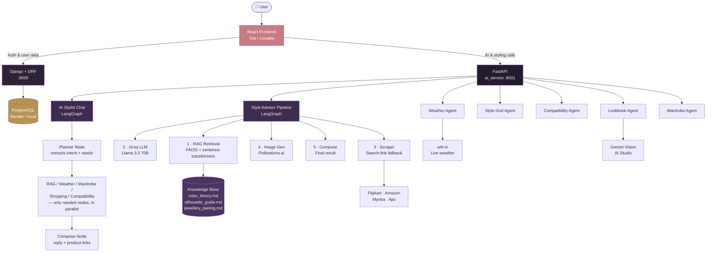
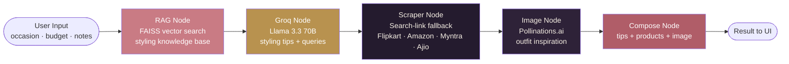
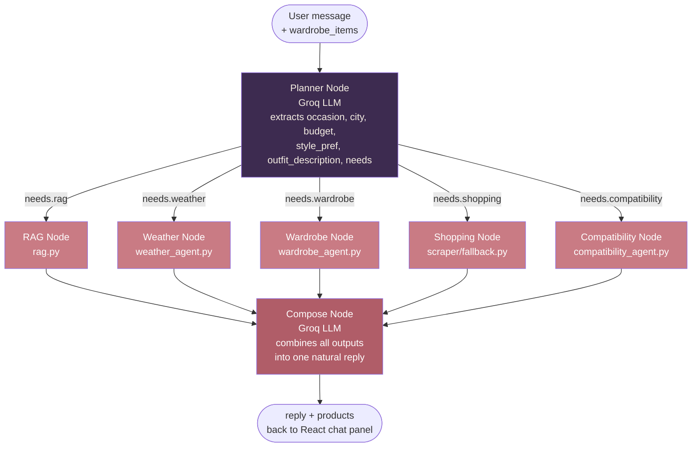
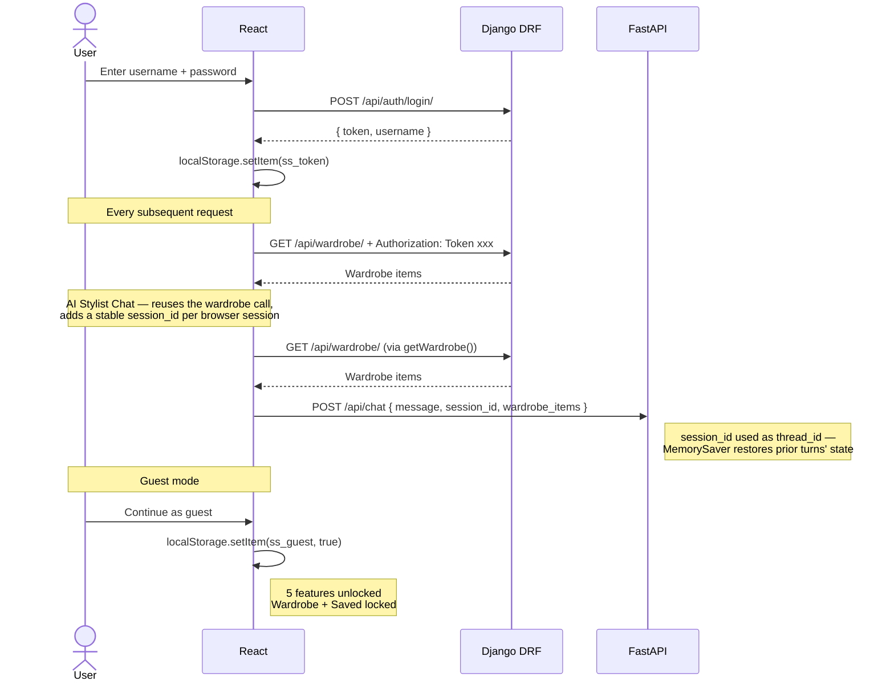

# StyleSense — AI Fashion Stylist for Indian Women

A multi-agent AI web application that acts as a personal fashion stylist.
Describe an occasion, get grounded styling advice, live shopping links,
weather-aware outfit suggestions, wardrobe memory, coordination feedback,
and now a conversational AI Stylist Chat — all from a single platform.

---

## Live Architecture

### System Overview



### LangGraph Pipeline (Style Advisor)



### LangGraph Pipeline (AI Stylist Chat) 

The chat graph decides its own path per message: a planner node extracts intent and a `needs`
dict, a conditional edge routes to only the relevant agent nodes, and
those run concurrently before converging on a single composed reply.


**Multi-turn memory :** the graph is compiled with a
`MemorySaver` checkpointer, keyed by a `session_id` generated once per
browser session and sent with every message as `thread_id`. The
planner node is prompted with what's already known from earlier turns
and only overwrites a field when the new message actually mentions it
— so "make it from my wardrobe" after "I have an interview tomorrow in
Bangalore" keeps the occasion and city instead of losing them.


### Auth Flow
 


---

## Features

| Feature | What it does |
|---|---|
| **Style Advisor** | Enter occasion + budget → 5-node LangGraph pipeline runs RAG retrieval → Groq LLM → scraper → outfit cards with Amazon / Flipkart / Myntra / Ajio links |
| **AI Stylist Chat** | Chat naturally instead of filling a form — a planner node reads intent and routes to only the relevant agents (RAG, weather, wardrobe, shopping, compatibility), which run in parallel and are composed into one reply with product links. Remembers context across turns via a LangGraph checkpointer, so follow-ups don't need to repeat the occasion, city, or budget |
| **Weather-aware Styling** | Enter city → live weather from wttr.in → Groq builds outfit advice around real temperature, humidity, conditions |
| **Ways to Style** | Enter clothing items → Groq plans variations → Pollinations.ai generates images in parallel → styled grid |
| **Compatibility Score** | Describe outfit → scored across Color Harmony / Occasion Fit / Formality / Accessories / Season with reason per dimension + one fix |
| **Lookbook Feedback** | Upload outfit photos → Gemini Vision returns coordination verdict, observations, single concrete fix |
| **My Wardrobe** | Add clothing items by name / category / colour → stored in Django → referenced in all wardrobe-aware features, including chat |
| **Style from Wardrobe** | Enter occasion → AI builds outfits from what you own first → flags missing piece with shop links |
| **Saved Outfits** | Save any styling result → collapsible cards with full note + product links + saved date |
| **Auth** | Register / login / guest mode → DRF token auth → guest gets 5 features, logged-in gets all 9 |

---

## Tech Stack

### Languages
- Python 3.11 — both backends
- JavaScript / TypeScript — React frontend

### AI & GenAI
| Tool | Usage |
|---|---|
| LangGraph | Style Advisor: fixed 5-node pipeline (RAG → Groq → Scraper → Image → Compose). AI Stylist Chat: planner + conditional multi-agent routing graph |
| LangChain | RAG chain: DirectoryLoader → RecursiveCharacterTextSplitter → HuggingFaceEmbeddings → FAISS |
| Groq (Llama 3.3 70B) | Styling advice, wardrobe planning, weather outfits, style grid variations, chat planner + composer |
| Groq Vision (Llama 4 Scout) | Lookbook photo coordination feedback |
| RAG | 3 curated knowledge base docs: color_theory.md, silhouette_guide.md, jewellery_pairing.md |
| Prompt Engineering | JSON-structured outputs with fallback parsing across all AI endpoints, including the chat planner and composer |

### Frameworks
- FastAPI — AI microservice (7 endpoints, async — including `/api/chat`)
- Django + DRF — auth, wardrobe, saved outfits, PostgreSQL models
- React + Vite (or Lovable) — 9-section dashboard + landing page

### Web Technologies
- React — component-based UI, hooks (useState, useEffect, useRef) for state and session handling
- REST API — all frontend-to-backend communication
- HTML / CSS / Tailwind

### Tools & Libraries
- BeautifulSoup — Flipkart + Amazon scraper (kept for reference; both the Style Advisor pipeline and the chat's shopping node use the more reliable search-link fallback instead)
- Pandas — scrape result deduplication and price sorting
- Git — version control
- Postman — API collection at `infra/StyleSense.postman_collection.json`

### Database
- PostgreSQL — via Django ORM (Render free tier in production)

### Cloud / Deployment
- Vercel — React frontend
- Render — FastAPI + Django + PostgreSQL (`render.yaml` included)

### External Free APIs (no credit card)
- **wttr.in** — live weather data
- **Pollinations.ai** — outfit image generation
- **Groq** — free tier LLM inference
- **Google AI Studio** — Gemini Vision free tier

---

## Project Structure

```
stylesense/
├── ai_service/                  FastAPI AI microservice
│   ├── main.py                  7 endpoints, incl. /api/chat
│   ├── agents/
│   │   ├── graph.py             LangGraph 5-node pipeline (Style Advisor)
│   │   ├── rag.py               FAISS RAG retrieval
│   │   ├── llm_providers.py     Groq + Gemini wrappers
│   │   ├── image_gen.py         Pollinations image generation
│   │   ├── wardrobe_agent.py    Wardrobe-aware styling agent
│   │   ├── weather_agent.py     wttr.in + Groq weather styling
│   │   ├── style_grid.py        Parallel image grid generation
│   │   ├── compatibility_agent.py  5-dimension outfit scorer
│   │   └── chat/                AI Stylist Chat
│   │       ├── state.py         ChatState schema
│   │       ├── nodes.py         planner, rag, weather, wardrobe,
│   │       │                    shopping, compatibility, compose nodes
│   │       └── graph.py         conditional-routing LangGraph
│   ├── scraper/
│   │   ├── base.py              Session, cache, rate limiting
│   │   ├── flipkart_scraper.py  BeautifulSoup scraper
│   │   ├── amazon_scraper.py    BeautifulSoup scraper
│   │   ├── myntra_scraper.py    JS-rendered — returns search link
│   │   └── fallback.py          Search-link generator (used by both
│   │                            Style Advisor and chat's shopping node)
│   └── knowledge_base/
│       ├── color_theory.md
│       ├── silhouette_guide.md
│       └── jewellery_pairing.md
│
├── backend_django/              Django + DRF data service
│   ├── core/
│   │   ├── models.py            SavedOutfit, WardrobeItem, FeedbackEntry
│   │   ├── serializers.py
│   │   ├── views.py             DRF ViewSets
│   │   ├── urls.py
│   │   └── auth_views.py        register / login / logout / me
│   └── stylesense/
│       └── settings.py
│
├── frontend/                    React (Vite) — local version
│   └── src/
│       ├── pages/
│       │   ├── Landing.jsx      Dark hero + auth card + guest mode
│       │   └── Dashboard.jsx    Sidebar + 9 feature sections
│       └── components/
│           ├── Sidebar.jsx
│           ├── StyleForm.jsx
│           ├── OutfitTagGrid.jsx
│           ├── StylistChat.jsx        AI Stylist Chat panel
│           ├── WeatherStyle.jsx
│           ├── StyleGrid.jsx
│           ├── CompatibilityScore.jsx
│           ├── Lookbook.jsx
│           ├── WardrobeManager.jsx
│           ├── WardrobeStyleResult.jsx
│           └── SavedOutfits.jsx
│
│
├── render.yaml                  Auto-deploys both services on Render
├── .env.example                 All keys documented with where to get them
```

---

## Running Locally

### Prerequisites
- Python 3.11+
- Node.js 18+
- PostgreSQL

### 1. Create the database
```bash
psql -U postgres -c "CREATE DATABASE stylesense;"
```

### 2. Set up environment
```bash
cp .env.example .env
# Fill in: GROQ_API_KEY, GOOGLE_AI_STUDIO_KEY, CLOUDINARY_*, DB_PASSWORD
```

### 3. FastAPI AI service (Terminal 1)
```bash
cd ai_service
python -m venv venv && source venv/bin/activate
pip install -r requirements.txt
python -m uvicorn main:app --port 8001 --reload
```

### 4. Django backend (Terminal 2)
```bash
cd backend_django
python -m venv venv && source venv/bin/activate
pip install -r requirements.txt
python manage.py makemigrations core
python manage.py migrate
python manage.py runserver 8005
```

### 5. React frontend (Terminal 3)
```bash
cd frontend
cp .env.example .env
npm install
npm run dev
```

Open **http://localhost:5173** (or 5174 if 5173 is taken).

---

## API Keys Needed (all free, no credit card)

| Key | Where to get | Time |
|---|---|---|
| `GROQ_API_KEY` | console.groq.com | 1 min |
| `GOOGLE_AI_STUDIO_KEY` | aistudio.google.com/apikey | 1 min |
| `CLOUDINARY_*` | cloudinary.com → Dashboard | 2 min |

---
