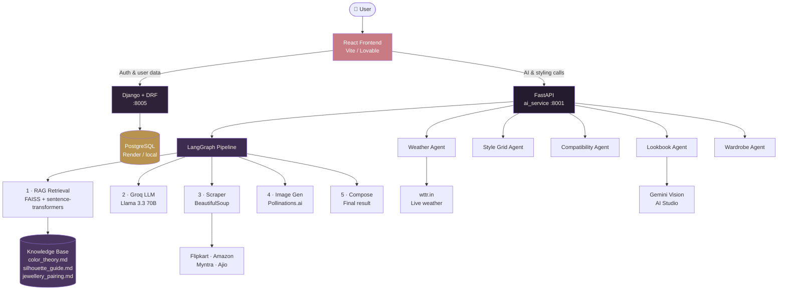
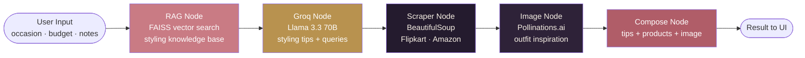
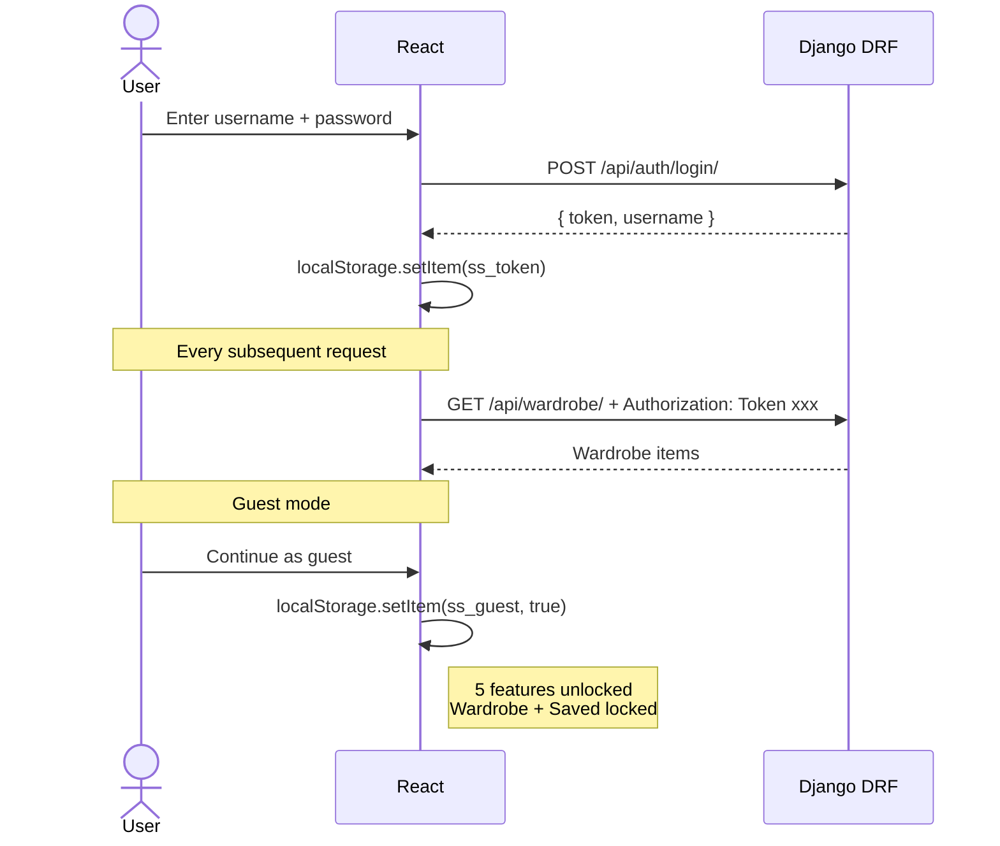

# StyleSense — AI Fashion Stylist for Indian Women

A multi-agent AI web application that acts as a personal fashion stylist.
Describe an occasion, get grounded styling advice, live shopping links,
weather-aware outfit suggestions, wardrobe memory, and coordination feedback
all from a single platform.

---

## Live Architecture

### System Overview



### LangGraph Pipeline (Style Advisor)



### Auth Flow



---

## Features

| Feature | What it does |
|---|---|
| **Style Advisor** | Enter occasion + budget → 5-node LangGraph pipeline runs RAG retrieval → Groq LLM → scraper → outfit cards with Amazon / Flipkart / Myntra / Ajio links |
| **Weather-aware Styling** | Enter city → live weather from wttr.in → Groq builds outfit advice around real temperature, humidity, conditions |
| **Ways to Style** | Enter clothing items → Groq plans variations → Pollinations.ai generates images in parallel → styled grid |
| **Compatibility Score** | Describe outfit → scored across Color Harmony / Occasion Fit / Formality / Accessories / Season with reason per dimension + one fix |
| **Lookbook Feedback** | Upload outfit photos → Gemini Vision returns coordination verdict, observations, single concrete fix |
| **My Wardrobe** | Add clothing items by name / category / colour → stored in Django → referenced in all wardrobe-aware features |
| **Style from Wardrobe** | Enter occasion → AI builds outfits from what you own first → flags missing piece with shop links |
| **Saved Outfits** | Save any styling result → collapsible cards with full note + product links + saved date |
| **Auth** | Register / login / guest mode → DRF token auth → guest gets 5 features, logged-in gets all 8 |

---

## Tech Stack

### Languages
- Python 3.11 — both backends
- JavaScript / TypeScript — React frontend

### AI & GenAI
| Tool | Usage |
|---|---|
| LangGraph | 5-node agent pipeline: RAG → Groq → Scraper → Image → Compose |
| LangChain | RAG chain: DirectoryLoader → RecursiveCharacterTextSplitter → HuggingFaceEmbeddings → FAISS |
| Groq (Llama 3.3 70B) | Styling advice, wardrobe planning, weather outfits, style grid variations, input cleaning |
| Groq Vision (Llama 4 Scout) | Lookbook photo coordination feedback |
| RAG | 3 curated knowledge base docs: color_theory.md, silhouette_guide.md, jewellery_pairing.md |
| Prompt Engineering | JSON-structured outputs with fallback parsing across all 6 AI endpoints |

### Frameworks
- FastAPI — AI microservice (6 endpoints, async)
- Django + DRF — auth, wardrobe, saved outfits, PostgreSQL models
- React + Vite (or Lovable) — 8-section dashboard + landing page

### Web Technologies
- Three.js — 3D rotating palette swatch hero (local version)
- REST API — all frontend-to-backend communication
- HTML / CSS / Tailwind

### Tools & Libraries
- BeautifulSoup — Flipkart + Amazon scraper with graceful fallback
- Pandas — scrape result deduplication and price sorting
- Git — version control
- Postman — API collection at `infra/StyleSense.postman_collection.json`

### Database
- PostgreSQL — via Django ORM (Render free tier in production)

### Cloud / Deployment
- Vercel — React frontend
- Render — FastAPI + Django + PostgreSQL (`render.yaml` included)

### External Free APIs (no credit card)
- **wttr.in** — live weather data
- **Pollinations.ai** — outfit image generation
- **Groq** — free tier LLM inference
- **Google AI Studio** — Gemini Vision free tier

---

## Project Structure

```
stylesense/
├── ai_service/                  FastAPI AI microservice
│   ├── main.py                  6 endpoints
│   ├── agents/
│   │   ├── graph.py             LangGraph 5-node pipeline
│   │   ├── rag.py               FAISS RAG retrieval
│   │   ├── llm_providers.py     Groq + Gemini wrappers
│   │   ├── image_gen.py         Pollinations image generation
│   │   ├── wardrobe_agent.py    Wardrobe-aware styling agent
│   │   ├── weather_agent.py     wttr.in + Groq weather styling
│   │   ├── style_grid.py        Parallel image grid generation
│   │   └── compatibility_agent.py  5-dimension outfit scorer
│   ├── scraper/
│   │   ├── base.py              Session, cache, rate limiting
│   │   ├── flipkart_scraper.py  BeautifulSoup scraper
│   │   ├── amazon_scraper.py    BeautifulSoup scraper
│   │   ├── myntra_scraper.py    JS-rendered — returns search link
│   │   └── fallback.py          Pandas cleanup + search link generator
│   └── knowledge_base/
│       ├── color_theory.md
│       ├── silhouette_guide.md
│       └── jewellery_pairing.md
│
├── backend_django/              Django + DRF data service
│   ├── core/
│   │   ├── models.py            SavedOutfit, WardrobeItem, FeedbackEntry
│   │   ├── serializers.py
│   │   ├── views.py             DRF ViewSets
│   │   ├── urls.py
│   │   └── auth_views.py        register / login / logout / me
│   └── stylesense/
│       └── settings.py
│
├── frontend/                    React (Vite) — local version
│   └── src/
│       ├── pages/
│       │   ├── Landing.jsx      Dark hero + auth card + guest mode
│       │   └── Dashboard.jsx    Sidebar + 8 feature sections
│       └── components/
│           ├── Sidebar.jsx
│           ├── StyleForm.jsx
│           ├── OutfitTagGrid.jsx
│           ├── WeatherStyle.jsx
│           ├── StyleGrid.jsx
│           ├── CompatibilityScore.jsx
│           ├── Lookbook.jsx
│           ├── WardrobeManager.jsx
│           ├── WardrobeStyleResult.jsx
│           └── SavedOutfits.jsx
│
├── infra/
│   ├── README.md                AWS deployment notes
│   └── StyleSense.postman_collection.json
│
├── render.yaml                  Auto-deploys both services on Render
├── .env.example                 All keys documented with where to get them
└── SETUP.md                     Local setup walkthrough
```

---

## Running Locally

### Prerequisites
- Python 3.11+
- Node.js 18+
- PostgreSQL

### 1. Create the database
```bash
psql -U postgres -c "CREATE DATABASE stylesense;"
```

### 2. Set up environment
```bash
cp .env.example .env
# Fill in: GROQ_API_KEY, GOOGLE_AI_STUDIO_KEY, CLOUDINARY_*, DB_PASSWORD
```

### 3. FastAPI AI service (Terminal 1)
```bash
cd ai_service
python -m venv venv && source venv/bin/activate
pip install -r requirements.txt
python -m uvicorn main:app --port 8001 --reload
```

### 4. Django backend (Terminal 2)
```bash
cd backend_django
python -m venv venv && source venv/bin/activate
pip install -r requirements.txt
python manage.py makemigrations core
python manage.py migrate
python manage.py runserver 8005
```

### 5. React frontend (Terminal 3)
```bash
cd frontend
cp .env.example .env
npm install
npm run dev
```

Open **http://localhost:5173** (or 5174 if 5173 is taken).

---

## API Keys Needed (all free, no credit card)

| Key | Where to get | Time |
|---|---|---|
| `GROQ_API_KEY` | console.groq.com | 1 min |
| `GOOGLE_AI_STUDIO_KEY` | aistudio.google.com/apikey | 1 min |
| `CLOUDINARY_*` | cloudinary.com → Dashboard | 2 min |

---

## Known Limitations

| Limitation | Reason | Extension path |
|---|---|---|
| Myntra scraping returns search link | JS-rendered SPA, can't scrape statically | Add Playwright headless browser |
| Image generation sometimes fails | Pollinations.ai free tier rate limits | Switch to Stability AI or pay tier |
| Lookbook vision uses daily quota | Gemini AI Studio free tier | Add billing to GCP account |
| Render free tier sleeps after 15 min | Free plan limitation | Upgrade to paid or add keep-alive ping |
| No generated try-on photo | Requires specialized virtual try-on model (IDM-VTON etc.) | Future scope |

---

## Future Scope

- **Personal Style Memory** — learn preferences over time, increasingly personalized recommendations
- **AI Closet Scan** — upload wardrobe photo, Gemini Vision auto-detects and categorises items
- **Smart Shopping Assistant** — analyse how well a new item matches existing wardrobe before buying
- **Capsule Wardrobe Generator** — given budget + days, generate minimum pieces + maximum outfits
- **Multi-Agent Debate** — multiple LangGraph stylist agents argue, a judge agent decides
- **Occasion Confidence %** — how suitable is an outfit for different occasions, shown as percentages
- **Outfit History** — track what was worn, avoid repeating, suggest variations
- **n8n automation** — scheduled price-drop alerts, re-scrape workflows
